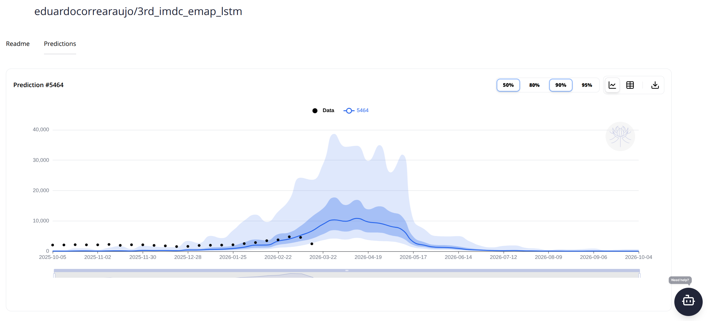

# Submit your predictions using (`mosqlient`)

To submit your predictions using `mosqlient` we will use the function 
`upload_prediction`. This function has the following parameters: 

| Field | Type | Description |
| :--- | :--- | :--- | 
| api_key | string | Your personal API authentication key. | 
| repository | str | Model repository. Format: "{owner or org}/{name}" | 
| disease |  str | Disease code (ICD-10); "A90": Dengue, "A92.0": Chikungunya, "A92.5: Zika  |
| description | str or None | Prediction description |
| commit | str | Git commit hash to lastest version of Prediction's code in the Model's repository |
| case_definition | str | "reported" or "probable". The case definition used for the prediction data. |
| published | bool _(True)_ | Whether this prediction is visible to the public. |
| adm_level | int (0, 1, 2, 3) | Administrative level, options: 0, 1, 2, 3 (National, State, Municipal, Sub-municipal) |
| adm_0 | str _(BRA)_ | Country isocode. Default: "BRA" |
| adm_1 | int _(UF)_ | State geocode. Example: 33 for RJ |
| adm_2 | int _(IBGE)_ | City geocode. Example: 3304557 |
| adm_3 | int _(IBGE)_ | Sub-municipality geocode. |
| prediction | pd.DataFrame | pandas DataFrame containing the columns: "date", "pred", "lower_95","lower_90", "lower_80", "lower_50", "upper_50", "upper_80", "upper_90", "upper_95" |
 
**About the Location Data (The `adm` fields):** 

Fill only the geographic level that your predictions refer to; leave all other levels as null.
* State-level model: Set `adm_level = 1`, fill in `adm_1`, and set `adm_2` and `adm_3` to null.
* City-level model: Set `adm_level = 2`, fill in `adm_2`, and set `adm_1` and `adm_3` to null.

**Understanding the columns of the prediction dataframe:**
* `date`: The forecast target date (YYYY-MM-DD).
* `pred`: The median (50th percentile) prediction.
* `lower_*` and `upper_*`: These form your prediction intervals. For example, lower_95 (2.5th percentile) and upper_95 (97.5th percentile) create your 95% confidence interval.

Also, to be accepted by the platform, your prediction data must strictly adhere to the following rules:

* **Sunday dates**: The prediction date must fall on a Sunday (for weekly predictions) to match the platform's validation data.
* **Continuous dates**: There can be no gaps in your sequence of dates.
* **Challenge Timeframe**: Your predictions must cover all dates between Epidemiological Week (EW) 41 of the previous year and EW 40 of the target year.
* **Positive Values**: All prediction values must be 0 or greater (no negative numbers).
* **Nested Intervals**: Your intervals must make logical, mathematical sense. The values must increase sequentially exactly like this:
`lower_95` ≤ `lower_90` ≤ `lower_80` ≤ `lower_50` ≤ `pred` ≤ `upper_50` ≤ `upper_80` ≤ `upper_90` ≤ `upper_95`

Import the necessary librarys:

```{r}
library(reticulate)
library(data.table)
library(dotenv)
```
Config python: 
```{r}
py_config()
```

Get your API_KEY:

```{r}
load_dot_env(".env")

# Access the environment variable
api_key <- Sys.getenv("API_KEY")
```


Now it is time to install the mosqlient

```{r}
# un/comment if you need to install them
py_require(c("epiweeks","python-dotenv", "mosqlient"))
mosq <- import("mosqlient")
```

##  Load the example prediction: 

The prediction below is a prediction from the last IMDC edition. It will be used here as an example of how submit a prediction.

```{r, results='hide'}
prediction <- fread("example_prediction2.csv")
head(prediction)
```

## Upload prediction

Fill the necessary parameters: 

```{r}
repository <- 'eduardocorrearaujo/3rd_imdc_emap_lstm' # fill with your repository name 
description <- 'Example of submitting predictions in the R tutorial'
commit <- 'cafe6f3aa759fcdd569952eeeea462814870d678'
disease <- 'A90' # dengue prediction
adm_level <- 1 # state level prediction
adm_1 <- 35 # example for SP
adm_2 <- NULL
case_definition <- 'probable' # The IMDC uses probable cases 
published <- T

```

Run the code below to registry the forecast the prediction:

```{r}
mosq$upload_prediction(
                api_key = api_key,
                repository = repository,
                description = description,
                commit = commit,
                disease=disease,
                case_definition=case_definition,
                adm_level = adm_level,
                adm_1 = adm_1,
                published = published,
                prediction = prediction
)
```

After saving, it will appear in the “Predictions” tab of your model: 


For more details check the [mosqlient documentation](https://mosqlimate-client.readthedocs.io/en/latest/tutorials/API/registry/). If you run into dificulties, please reach out fo help at our [discord server](https://discord.gg/yqtgW4TC)