# Relatório científico do XGBSillas para previsão probabilística semanal de dengue e chikungunya

## 1. Escopo do projeto em relação aos dados

O projeto responde ao 3rd Infodengue-Mosqlimate Dengue Challenge, que exige previsões probabilísticas semanais para a temporada epidemiológica EW41-EW40. O desafio obrigatório é dengue em nível de UF, excluindo Espírito Santo. Os desafios opcionais avaliados neste relatório são dengue municipal, chikungunya em UF e chikungunya municipal.

Os dados epidemiológicos originais de dengue cobrem as semanas epidemiológicas de 2010-01 até 2026-10. Os dados originais de chikungunya cobrem de 2014-01 até 2026-10. Depois do processamento, os painéis semanais usados pelo modelo terminam em 2026-03-08, que era a última semana observada disponível na base processada no momento da validação. Os painéis processados de dengue começam em 2010-01-03, os de chikungunya começam em 2013-12-29. Cada linha original representa uma localidade em uma semana epidemiológica, com casos observados e covariáveis associadas.

Além das séries de casos, o treinamento usa clima observado, população Datasus, índices oceânicos, mapas de região de saúde e macroregião, vizinhança espacial e variáveis ambientais derivadas do MapBiomas. O clima previsto foi mantido no repositório como dado baixado, mas a modelagem final prioriza covariáveis observadas e estáveis até o corte temporal para reduzir risco de vazamento e dependência de previsões auxiliares.

A matriz supervisionada final é construída com origem oficial na semana epidemiológica 25 de cada ano histórico. Em uma origem de corte `c`, o modelo usa apenas dados observáveis até `c`, respeita um intervalo de 16 semanas entre corte e início da temporada prevista, e cria alvos para as 52 semanas seguintes. Assim, cada linha de treino representa uma pergunta localidade-origem-horizonte:

$$
x_{i,c,t} = f(\{y_{i,s}: s \leq c\},\ \{z_{i,s}: s \leq c\},\ i,\ c,\ t)
$$

$$
y_{i,t}, \quad t \geq c + 16\ \text{semanas}
$$

Esse desenho simula exatamente o tipo de previsão anual exigida pelo desafio e evita treinar com origens semanais que não correspondem ao uso final do modelo. Experimentos com todas as semanas rolantes aumentaram o número de exemplos, mas foram inferiores ao treino EW25 nos testes finais. As 52 semanas entram como uma temporada futura completa, mas cada semana alvo é modelada como uma linha própria, com seu horizonte, semana epidemiológica e fase sazonal.

## 2. Variáveis escolhidas

A pipeline constrói a matriz supervisionada em `src/features.py`, usando apenas informação disponível até a origem de previsão. Para cada localidade `i`, origem de corte `c` e semana alvo `t`, a linha de modelagem é definida como um vetor de atributos `X_{i,c,t}` e um alvo `Y_{i,t}`. O corte oficial é a semana epidemiológica 25 do ano de origem, e a temporada alvo começa na EW41, de modo que há um intervalo operacional de 16 semanas entre o último dado observado e a primeira semana prevista. A matriz usada em validação e forecast final é, portanto,

$$
X_{i,c,t}=f\left(\{Y_{i,s}:s\leq c\},\{Z_{i,s}:s\leq c\},i,c,t\right),
\qquad t \in \text{EW41}(a),\ldots,\text{EW40}(a+1),
$$

onde `Z` representa covariáveis climáticas, oceânicas, espaciais, populacionais e ambientais observáveis no corte. Essa definição é importante porque a pipeline não usa valores da temporada futura para construir preditores. A função `load_training_matrix` em `src/backtest.py` também verifica que o maior `target_end_date` do treino não ultrapassa o cutoff da validação correspondente e que nenhuma origem de treino pertence ao ano validado.

O primeiro bloco de variáveis descreve memória local recente da série de casos. Para cada localidade, a pipeline calcula defasagens semanais `cases_lag_k`, com $k \in \{1,2,3,4,6,8,12,26,52\}$, e estatísticas móveis de média e máximo para janelas de 4, 8 e 12 semanas. Em notação, para uma janela `m`,


$$
cases\_roll\_mean\_m_{i,c}=\frac{1}{m}\sum_{r=0}^{m-1}Y_{i,c-r},
\qquad
cases\_roll\_max\_m_{i,c}=\max_{0\leq r<m}Y_{i,c-r}.
$$


Essas variáveis resumem nível, persistência e intensidade recente. Além das médias e máximos, o código calcula tendência logarítmica recente por regressão linear em `log1p(casos)`, aceleração logarítmica, sinal da tendência e uma razão de momentum entre as duas últimas semanas e as duas semanas anteriores. Esses termos buscam diferenciar séries em ascensão, queda ou estabilização no momento da origem.

O segundo bloco é sazonal e histórico. Para a semana epidemiológica alvo `w(t)`, são calculados quantis históricos dos casos da mesma semana epidemiológica usando apenas observações até `c`:

$$
Q_{\alpha,i,w,c}^{hist}=Q_{\alpha}\{Y_{i,s}:w(s)=w,\ s\leq c\},
\qquad \alpha\in\{0.05,0.10,0.25,0.75,0.90,0.95\}.
$$

A matriz também inclui `historical_mean`, `historical_median`, `seasonal_naive`, `historical_peak_week` e `weeks_to_historical_peak`. O `seasonal_naive` é o valor histórico mais recente observado naquela semana epidemiológica, não uma observação futura da temporada alvo. A combinação entre quantis históricos, mediana sazonal e distância ao pico dá ao XGBoost uma referência de escala local e de fase sazonal.

O terceiro bloco representa fase da temporada e interação com horizonte. A semana alvo entra por seno e cosseno sazonais,

$$
week\_sin_{t}=\sin\left(2\pi w(t)/52\right),
\qquad
week\_cos_{t}=\cos\left(2\pi w(t)/52\right),
$$

além dos indicadores `phase_start`, `phase_peak` e `phase_tail`. O horizonte `h` também entra diretamente, e a pipeline cria interações como `horizon_x_weeks_to_peak`, `horizon_x_phase_peak` e `epidemic_intensity`. A intensidade epidêmica é definida, quando possível, como a razão entre o máximo recente de quatro semanas e o quantil histórico 90 da semana alvo:

$$
epidemic\_intensity_{i,c,t}=\frac{\text{cases\_roll\_max\_4}_{i,c}}{Q_{0.90,i,w(t),c}^{hist}+1}.
$$

O quarto bloco descreve pressão espacial. Nos desafios municipais, a matriz inclui agregados da região de saúde, macroregião de saúde e UF, com lags, médias móveis e máximos recentes. Por exemplo,

$$
regional\_cases\_max\_lag\_1_{i,c}=\max_{j\in R(i)}Y_{j,c},
\qquad
macroregional\_cases\_roll\_max\_4_{i,c}=\max_{0\leq r<4}\sum_{j\in M(i)}Y_{j,c-r}.
$$

Nos desafios de UF, a pipeline usa agregados de macroregião aproximados pelo primeiro dígito do código da UF, como `macroregion_cases_sum`, `macroregion_cases_max`, `macroregion_incidence_mean` e `macroregion_incidence_max`, também transformados em lags e médias móveis. Para UFs também há variáveis de vizinhança geográfica derivadas de `src/spatial.py`, como casos e incidência média ou máxima nos vizinhos. Essas variáveis são úteis porque surtos arbovirais frequentemente têm estrutura espacial e temporal compartilhada.

O quinto bloco contém clima observado e índices oceânicos. Para temperatura média, precipitação total e umidade relativa média, entram médias móveis curtas de 4, 8 e 12 semanas, lags semanais e agregados em três escalas: último mês, semestre anterior e ano anterior. A precipitação usa agregados por soma nas janelas mensais e médias desses agregados nas escalas longas, temperatura e umidade usam médias. Os índices oceânicos `enso`, `iod` e `pdo` entram como lags mensais de 1 a 12 meses, aproximados por deslocamentos de quatro semanas:

$$
\text{pdo\_month\_lag\_m}_{c}=\text{pdo}_{c-4m},\qquad m=1,\ldots,12.
$$

Esse bloco não deve ser interpretado causalmente no relatório. Ele funciona como conjunto de marcadores climáticos de grande escala que podem estar associados a padrões sazonais e regionais, mas a modelagem é estritamente preditiva.

O sexto bloco reúne descritores fixos ou quase fixos. A população entra para preservar escala absoluta e também para calcular incidência por 100 mil habitantes. `location_code` e `origin_year` capturam heterogeneidade espacial persistente e variação interanual ampla. As variáveis MapBiomas entram com proporções de classes de uso e cobertura da terra, diversidade de uso da terra e mudanças anuais recentes. A diversidade é calculada como índice de Shannon,

$$
H_i=-\sum_k p_{i,k}\log(p_{i,k}),
$$

e as proporções ambientais seguem

$$
\text{share}_{i,k}=\frac{\text{area}_{i,k}}{\sum_j \text{area}_{i,j}}.
$$

Na matriz final, MapBiomas é tratado como contexto territorial publicado antes do cutoff: para uma origem em ano `a`, a pipeline usa no máximo o ano `a-1`. Isso evita depender de informação territorial ainda não disponível no momento da previsão.

## 3. Análise das variáveis: importância, correlação e colinearidade

A tabela abaixo lista as dez variáveis mais importantes no modelo final escolhido para cada desafio no `validation_3`. A importância é a importância interna do estimador XGBoost e deve ser lida como diagnóstico preditivo, não como efeito causal.

| Desafio | Modelo final | Variáveis principais em `validation_3` |
|---|---|---|
| `dengue_uf` | `xgb_residual` | `pdo_month_lag_11`, `pdo_month_lag_1`, `pdo_month_lag_12`, `iod_month_lag_1`, `pdo_month_lag_5`, `enso_month_lag_3`, `mapbiomas_land_use_diversity`, `temp_last_year`, `temp_last_month`, `temp_med_lag_2` |
| `dengue_city` | `xgb_residual` | `iod_month_lag_3`, `enso_month_lag_9`, `uf_cases_max_lag_1`, `iod_month_lag_6`, `uf_incidence_max_lag_1`, `macroregional_cases_roll_max_4`, `rel_humid_med_lag_2`, `regional_incidence_max_lag_52`, `regional_cases_max_lag_1`, `uf_cases_max_lag_52` |
| `chikungunya_uf` | `xgb_quantile_log1p` | `macroregion_cases_max_lag_4`, `macroregion_incidence_max_roll_mean_8`, `macroregion_cases_max_lag_1`, `macroregion_cases_sum_lag_8`, `cases_roll_mean_8`, `macroregion_cases_max_lag_2`, `cases_roll_mean_4`, `macroregion_cases_max_roll_mean_4`, `cases_roll_mean_12`, `iod_month_lag_5` |
| `chikungunya_city` | `xgb_quantile` | `regional_incidence_max_roll_max_4`, `regional_cases_max_roll_max_4`, `cases_roll_max_4`, `temp_last_semester`, `mapbiomas_land_use_diversity`, `enso_month_lag_11`, `mapbiomas_pasture_share`, `mapbiomas_agriculture_share`, `regional_cases_max_roll_mean_8`, `iod_month_lag_12` |

A leitura epidemiológica por famílias é mais estável do que a leitura de uma variável isolada. Em dengue UF, os modelos finais selecionaram principalmente índices oceânicos, temperatura agregada e contexto territorial, enquanto a versão direta do XGBoost também destacava médias e máximos recentes de casos. Em dengue municipal, a importância se deslocou para pressão de UF, macroregião e lags climáticos/oceânicos, consistente com a ideia de que municípios individuais são ruidosos e se beneficiam de informação espacial agregada. Em chikungunya UF, a família dominante foi pressão de macroregião e memória local recente. Em chikungunya municipal, os principais atributos combinaram pressão regional, máximo local recente, temperatura agregada e MapBiomas.

A colinearidade é esperada na matriz. Lags próximos, médias móveis sobrepostas, máximos regionais e quantis históricos adjacentes são leituras parcialmente redundantes do mesmo processo epidêmico. Os arquivos `*_top_feature_vif.csv` confirmam VIFs altos em algumas famílias espaciais: por exemplo, `macroregion_cases_max_lag_1` e `macroregion_cases_max_lag_2` em chikungunya UF, e máximos macroregionais em dengue municipal. Em modelos lineares interpretativos isso seria uma limitação séria, já em árvores boosted, a redundância tende a ser tratada por seleção de cortes alternativos. A decisão prática foi não remover variáveis por VIF, porque a métrica de validação penaliza diretamente qualquer redundância que piore previsão.

As figuras atualizadas de variáveis são:

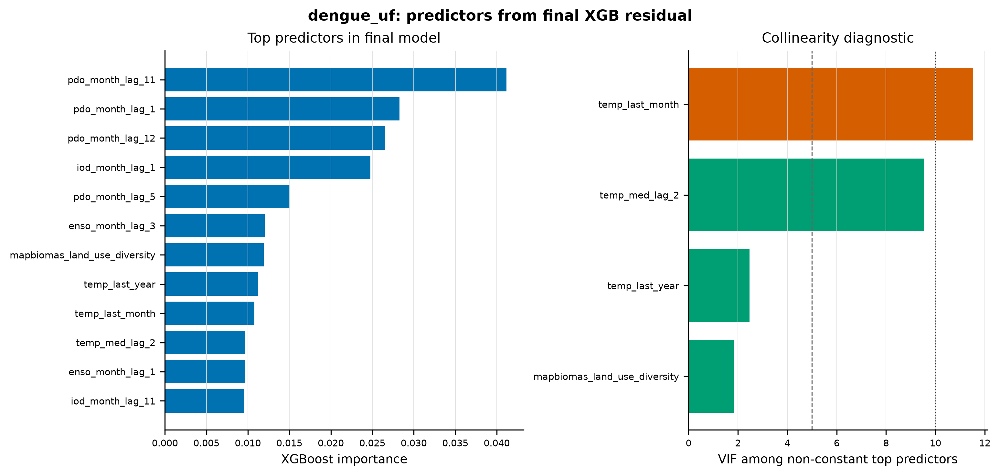

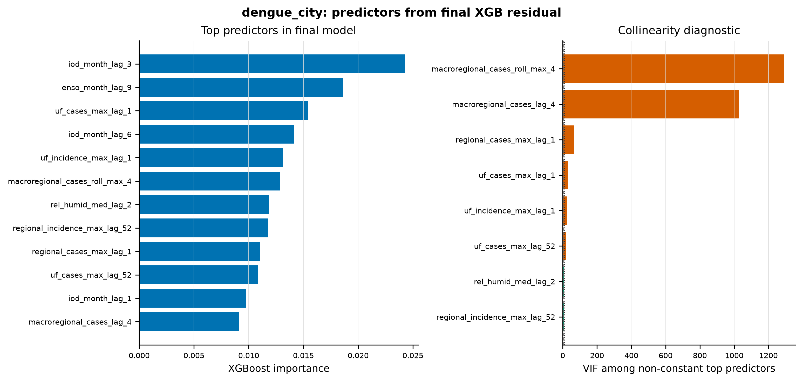

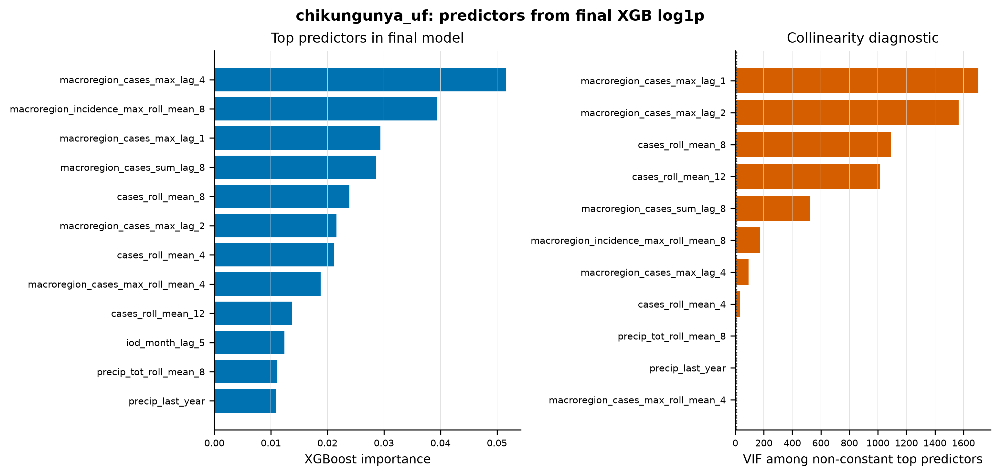

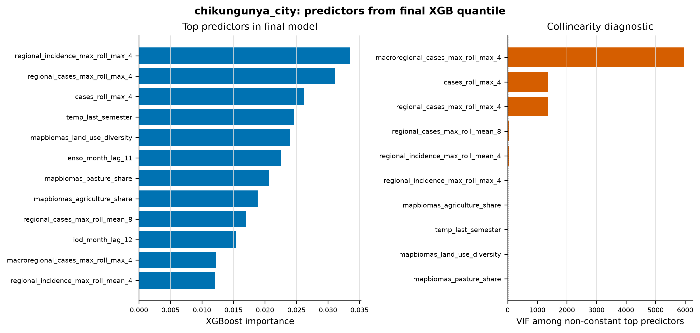

As matrizes de correlação devem ser usadas apenas como diagnóstico complementar, não como figura central. Quando uma variável é constante no subconjunto analisado, a correlação é indefinida, por isso, o relatório prioriza importância de árvore, VIF e desempenho temporal. Essa escolha mantém a análise simples e evita dar peso visual excessivo a matrizes instáveis.

## 4. Modelos escolhidos e formulação matemática

O objetivo probabilístico da pipeline é estimar quantis condicionais dos casos semanais futuros:

$$
\widehat{Q}_{\alpha}(Y_{i,t}\mid X_{i,c,t}),
\qquad
\alpha \in \{0.025,0.05,0.10,0.25,0.50,0.75,0.90,0.95,0.975\}.
$$

Esses quantis formam a mediana e os intervalos centrais de 50%, 80%, 90% e 95% exigidos pela submissão. Após a predição, a função `enforce_quantile_order` ordena os quantis e trunca valores negativos, garantindo coerência monotônica:

$$
0 \leq \widehat{Q}_{0.025}\leq \widehat{Q}_{0.05}\leq \cdots \leq \widehat{Q}_{0.975}.
$$

O baseline histórico usa a mediana histórica sazonal e aproxima a escala pela distância interquartílica. Para a semana epidemiológica `w`,

$$
\sigma_{i,w}=\frac{Q^{hist}_{0.75,i,w}-Q^{hist}_{0.25,i,w}}{1.349},
$$

com limite inferior de escala para evitar intervalos degenerados. O quantil previsto pelo baseline é

$$
\widehat{Q}^{base}_{\alpha,i,t}=\max\left(0,\;m_{i,w}+z_{\alpha}\sigma_{i,w}\sqrt{1+h/52}\right),
$$

onde `h` é o horizonte dentro da temporada. Esse baseline não é o modelo final de submissão, mas serve como referência e como âncora do modelo residual.

O XGBoost quantílico aprende diretamente os quantis condicionais usando a perda pinball. Para um quantil $\alpha$, erro `u=y-q` e predição $q=f_{\theta,\alpha}(X)$, a perda é

$$
\rho_{\alpha}(u)=
\begin{cases}
\alpha u, & u\geq 0,\\
(\alpha-1)u, & u<0.
\end{cases}
$$

A função objetivo empírica é

$$
\mathcal{L}(\theta)=
\sum_{(i,c,t)\in\mathcal{D}}w_{i,c,t}
\sum_{\alpha\in\mathcal{A}}\rho_{\alpha}\left(Y_{i,t}-f_{\theta,\alpha}(X_{i,c,t})\right).
$$

Na implementação atual, `XGBRegressor` é treinado com `objective="reg:quantileerror"` e `quantile_alpha` contendo todos os quantis da submissão. Assim, um único estimador por modelo aprende uma saída multiquantílica, em vez de nove modelos independentes. A ponderação `w` dá maior peso a origens próximas da EW25 oficial e, quando habilitada, aumenta o peso de observações que excedem quantis históricos altos. Essa ponderação não altera a definição da métrica de avaliação, ela apenas muda a distribuição efetiva de treino para que semanas epidêmicas não sejam diluídas pelo grande número de semanas de baixa contagem.

O modelo `xgb_quantile` usa casos na escala original. Ele é mais direto e preserva a unidade da variável de interesse, mas pode ser dominado por picos absolutos grandes. O modelo `xgb_quantile_log1p` usa

$$
Z=\log(1+Y)
$$

como alvo de treino e retorna à escala de casos por

$$
\widehat{Y}=\exp(\widehat{Z})-1.
$$

Essa transformação reduz a influência de valores extremos e foi especialmente útil em chikungunya UF no `validation_3`. O terceiro modelo, `xgb_residual`, usa o baseline histórico como âncora sazonal e aprende o resíduo em escala logarítmica:

$$
R=\log(1+Y)-\log(1+m^{base}).
$$

Na predição, os quantis residuais são somados à escala logarítmica do baseline e reconvertidos para casos:

$$
\widehat{Q}_{\alpha}(Y)=
\max\left(0,\exp\left(\log(1+m^{base})+\widehat{Q}_{\alpha}(R)\right)-1\right).
$$

Esse desenho foi escolhido para dengue UF e dengue municipal porque a mediana histórica captura parte relevante da escala sazonal, enquanto o XGBoost aprende correções não lineares associadas a clima, pressão espacial, ano de origem e contexto territorial. Para chikungunya, a seleção final ficou com `xgb_quantile_log1p` em UF e `xgb_quantile` em municípios.

A métrica principal é o Weighted Interval Score. Para um intervalo central com limites `l` e `u` e nível de erro `\alpha`,

$$
IS_{\alpha}(l,u;y)=
(u-l)+\frac{2}{\alpha}(l-y)\mathbb{I}(y<l)+\frac{2}{\alpha}(y-u)\mathbb{I}(y>u).
$$

O WIS combina o erro absoluto da mediana e os intervalos centrais de 50%, 80%, 90% e 95%:

$$
WIS=
\frac{0.5|y-\widehat{m}|+\sum_{k=1}^{K}\frac{\alpha_k}{2}IS_{\alpha_k}}
{K+0.5}.
$$

Essa métrica penaliza simultaneamente mediana deslocada, intervalos excessivamente largos e observações que caem fora dos intervalos. Por isso, o WIS foi usado como critério primário, enquanto MAE e viés foram mantidos como diagnósticos auxiliares do centro da distribuição.

## 5. Resultado tabular dos modelos no validation 3

A tabela abaixo foi atualizada a partir de `data/results/figures/model_comparison/all_challenges_validation_3_model_scores.csv`. Ela compara os modelos próprios e, quando disponível, o LSTM EMAp externo usando apenas linhas `location_code`-`date` comuns entre os modelos de cada desafio. O WIS é a métrica de ranking, MAE e viés descrevem a mediana prevista.

| Desafio | Modelo | Linhas | WIS | MAE | Viés | Rank |
|---|---|---:|---:|---:|---:|---:|
| `chikungunya_city` | XGB quantile | 520 | 33.07 | 38.89 | -34.28 | 1 |
| `chikungunya_city` | XGB log1p | 520 | 33.97 | 39.63 | -38.61 | 2 |
| `chikungunya_city` | XGB residual | 520 | 35.59 | 39.77 | -36.81 | 3 |
| `chikungunya_city` | Baseline histórico | 520 | 38.48 | 40.45 | -39.19 | 4 |
| `chikungunya_uf` | XGB log1p | 1352 | 59.29 | 97.65 | -53.70 | 1 |
| `chikungunya_uf` | XGB quantile | 1352 | 62.61 | 114.88 | -2.50 | 2 |
| `chikungunya_uf` | LSTM EMAp | 1352 | 79.48 | 128.96 | 5.21 | 3 |
| `chikungunya_uf` | Baseline histórico | 1352 | 79.83 | 96.08 | -72.57 | 4 |
| `chikungunya_uf` | XGB residual | 1352 | 93.99 | 109.65 | -37.63 | 5 |
| `dengue_city` | XGB residual | 780 | 107.85 | 152.77 | -113.14 | 1 |
| `dengue_city` | XGB quantile | 780 | 113.76 | 147.24 | -126.71 | 2 |
| `dengue_city` | LSTM EMAp | 780 | 117.23 | 180.97 | -160.21 | 3 |
| `dengue_city` | XGB log1p | 780 | 126.71 | 177.62 | -174.12 | 4 |
| `dengue_city` | Baseline histórico | 780 | 136.51 | 175.47 | -173.50 | 5 |
| `dengue_uf` | LSTM EMAp | 1352 | 386.82 | 731.63 | -316.61 | 1 |
| `dengue_uf` | XGB residual | 1352 | 427.23 | 904.00 | -686.96 | 2 |
| `dengue_uf` | Baseline histórico | 1352 | 612.82 | 937.12 | -837.09 | 3 |
| `dengue_uf` | XGB quantile | 1352 | 755.71 | 993.36 | -633.66 | 4 |
| `dengue_uf` | XGB log1p | 1352 | 808.60 | 1037.79 | -931.13 | 5 |

A seleção final para submissão usa o melhor modelo próprio por desafio ou o modelo próprio mais estável quando a comparação externa vence. Assim, a submissão atual usa `xgb_residual` em dengue UF e dengue municipal, `xgb_quantile_log1p` em chikungunya UF e `xgb_quantile` em chikungunya municipal. Em dengue UF, o LSTM EMAp externo teve menor WIS no `validation_3`, mas ele é usado apenas como referência externa neste relatório, a submissão deste repositório permanece baseada nos modelos próprios XGBoost.

A tabela seguinte resume os modelos finais próprios ao longo das validações completas disponíveis em `data/results/metrics/*/wis_by_model.csv`. Ela mostra a média simples de `validation_1`, `validation_2` e `validation_3`. `validation_4` ainda não entra nessa média porque a temporada 2025-2026 não estava completamente observada na base usada pela pipeline.

| Desafio | Modelo final | WIS médio v1-v3 | MAE médio v1-v3 | Viés médio v1-v3 |
|---|---|---:|---:|---:|
| `dengue_uf` | `xgb_residual` | 1220.80 | 1982.59 | -1845.67 |
| `dengue_city` | `xgb_residual` | 136.74 | 187.07 | -151.39 |
| `chikungunya_uf` | `xgb_quantile_log1p` | 100.18 | 129.96 | -108.36 |
| `chikungunya_city` | `xgb_quantile` | 34.37 | 40.43 | -36.81 |

O viés negativo aparece em todos os modelos finais, indicando subestimação média da mediana. Esse comportamento é comum em séries epidêmicas com picos raros e altos: a maior parte das semanas tem baixa contagem, enquanto poucas semanas concentram grande parte dos casos. A interpretação correta, portanto, combina WIS, MAE, viés e inspeção visual das curvas locais.

## 6. Resultado gráfico dos modelos: curvas acumuladas

As figuras agregadas somam as localidades de cada desafio por semana. Elas são úteis para avaliar se os modelos acompanham a forma global da temporada, mas podem esconder erros locais.

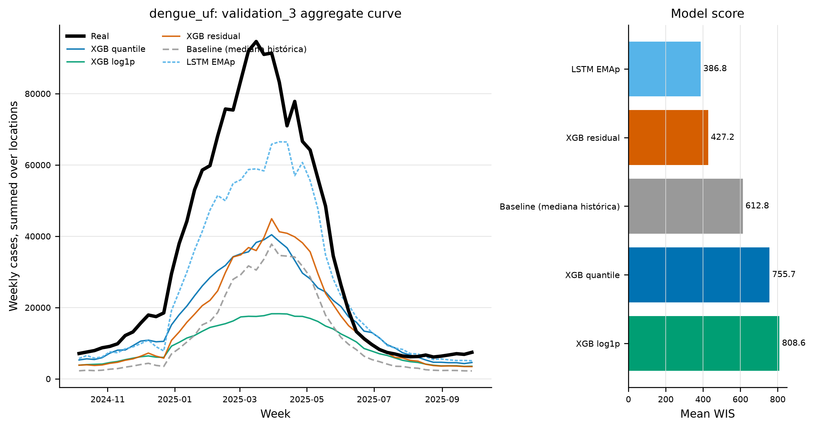

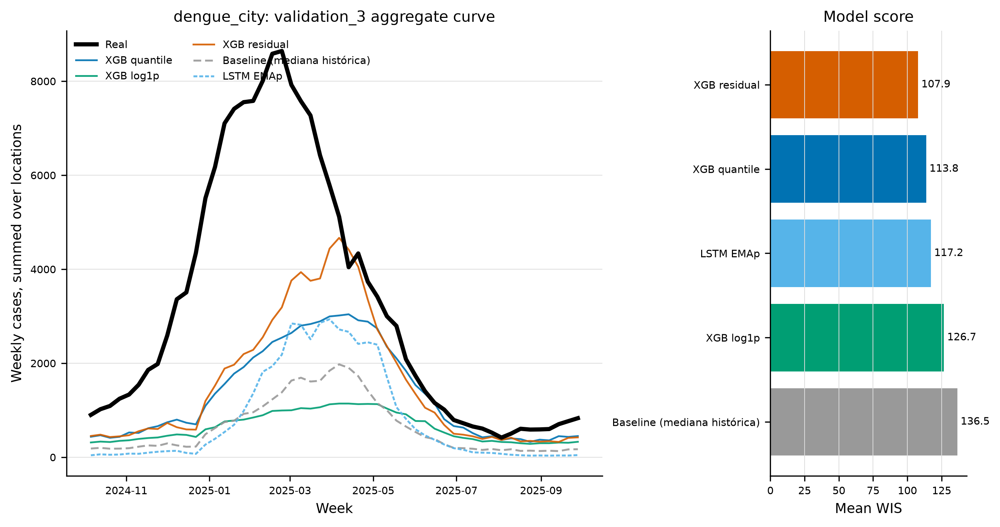

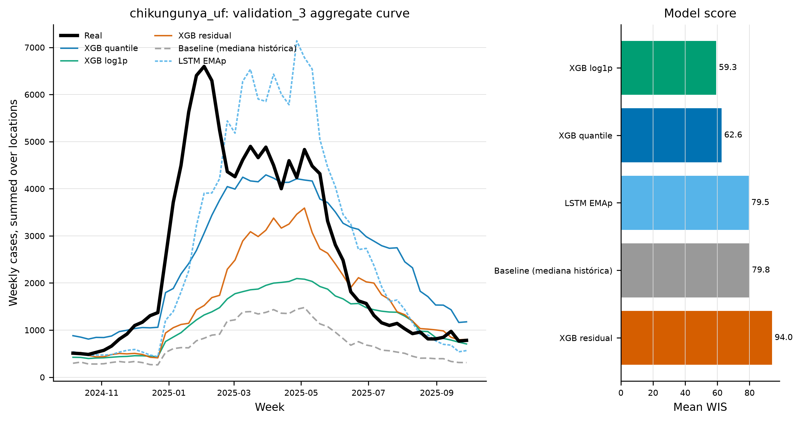

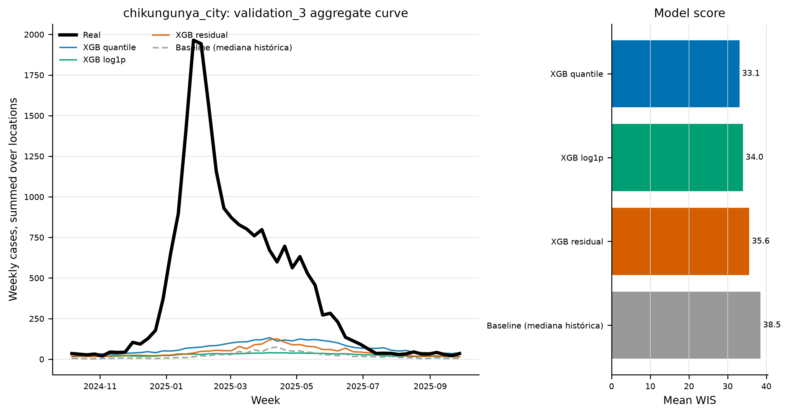

Nos agregados, a leitura central é a forma da curva observada: início, aceleração, pico, queda e cauda. Os XGBoost testam quanto as covariáveis recentes, regionais e ambientais explicam essa dinâmica quando treinadas no desenho oficial EW25.

## 7. Resultado gráfico dos modelos: localidades com melhor e pior desempenho

Para evitar que a análise fique restrita à curva acumulada, foram geradas figuras específicas com duas localidades onde o melhor modelo do desafio performou bem e duas onde performou pior, medidas por WIS local. Em painéis onde previsões muito altas comprimiriam a curva observada, o eixo Y foi limitado à escala da curva real e marcado como `y-axis capped`.

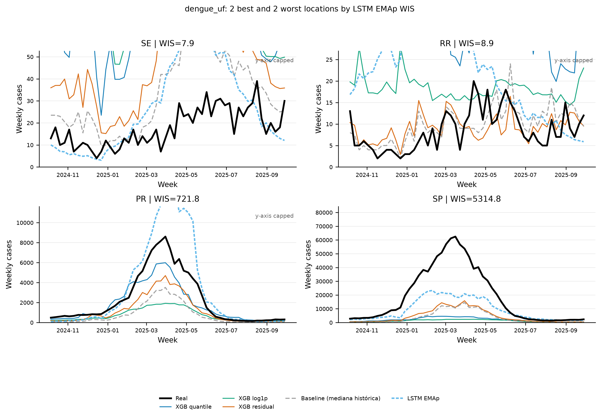

No dengue UF, a análise local deve separar erro de fase e erro de magnitude. Um modelo pode acertar a semana aproximada do pico e ainda perder WIS se os intervalos forem estreitos demais ou se a mediana ficar sistematicamente abaixo da curva observada. Estados com alta carga absoluta tendem a dominar o erro agregado, mas o WIS por localidade também revela falhas em unidades pequenas quando a previsão fica persistentemente deslocada.

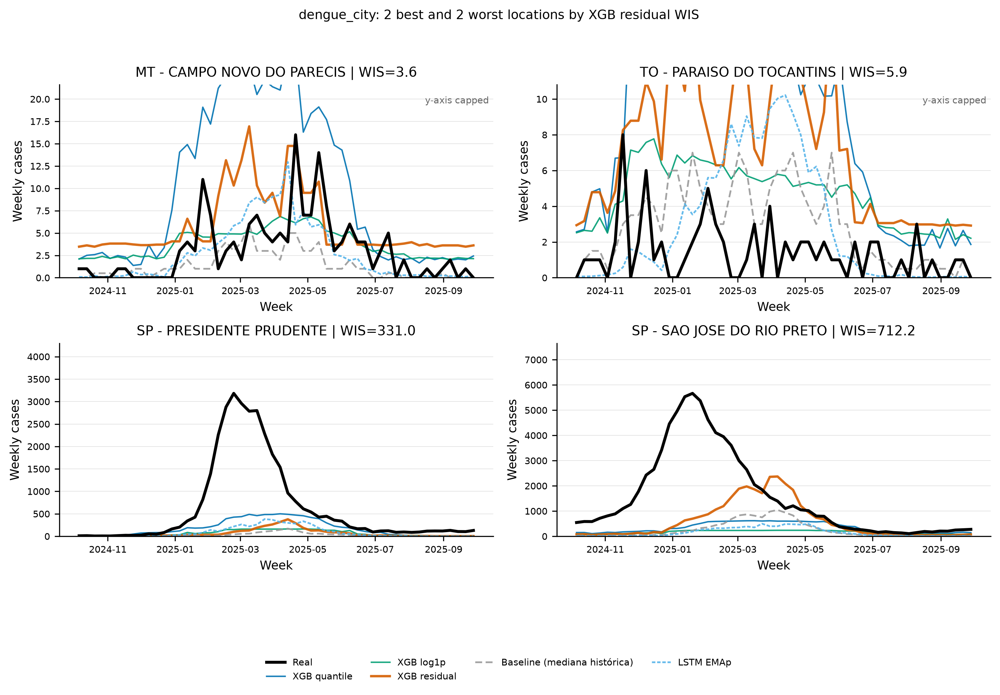

Em dengue municipal, muitos municípios têm poucas notificações, e nesses casos uma curva quase plana pode gerar bom WIS sem demonstrar capacidade real de antecipar surtos. As figuras de melhores e piores localidades devem, portanto, ser lidas junto com a incidência: uma melhora em município com curva alta é epidemiologicamente mais informativa do que uma melhora em série dominada por zeros e ruído de notificação.

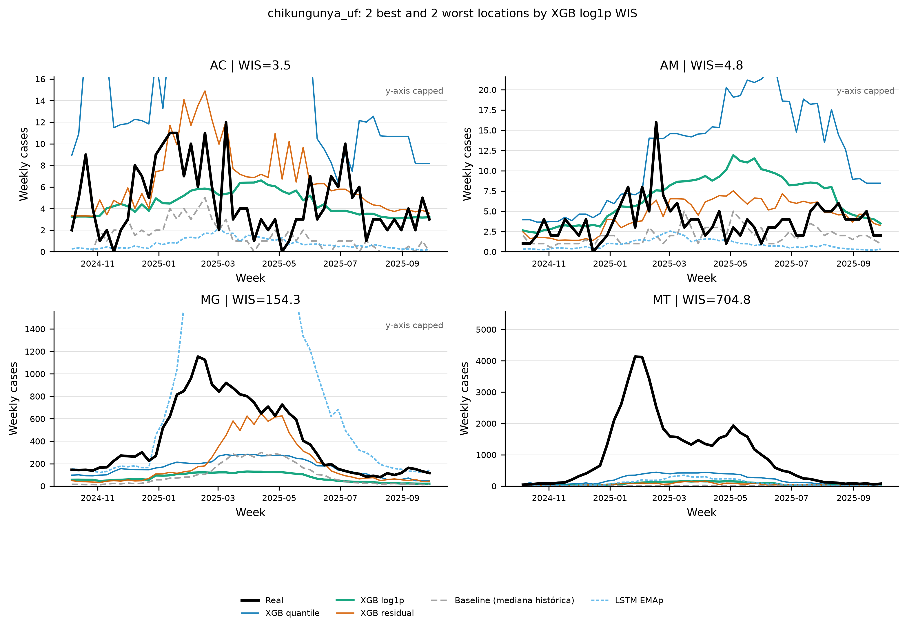

Em chikungunya UF, a escala logarítmica reduz a dominância de picos absolutos e foi a alternativa própria mais competitiva contra o LSTM EMAp. A leitura local ajuda a separar ganho real em regiões com curva relevante de simples melhora em séries baixas.

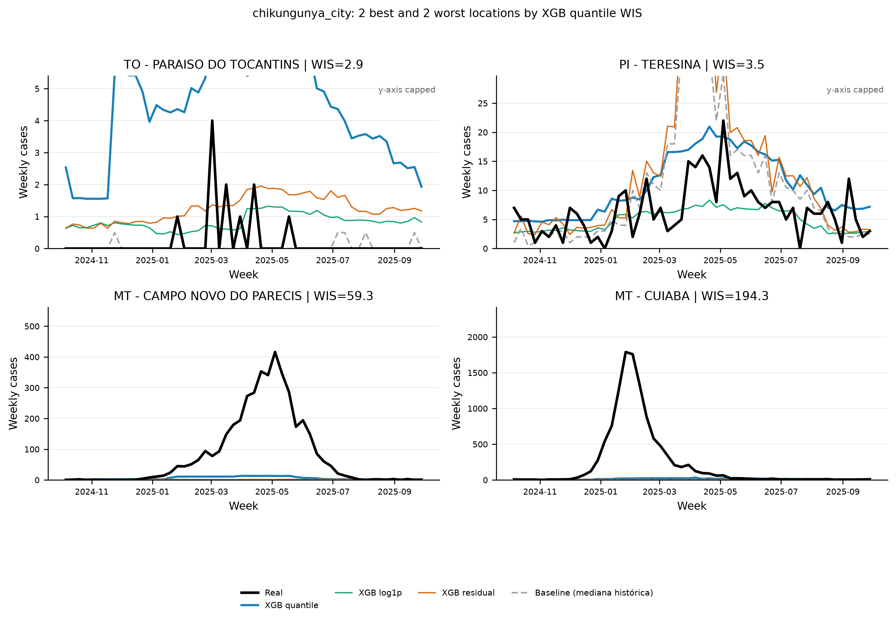

Em chikungunya municipal, a escala de casos é menor e a esparsidade é maior. Por isso, a análise por localidade é indispensável. Um modelo pode ter bom WIS agregado por acertar muitas séries baixas, mas falhar justamente nas poucas cidades com curvas epidemiologicamente relevantes.

## 8. Análise estatística dos resíduos

Os resíduos são definidos pela diferença entre a mediana prevista e o observado:

$$
e_{i,t} = \widehat{y}_{0.5,i,t} - y_{i,t}
$$

Valores positivos indicam superestimação, valores negativos indicam subestimação. As figuras abaixo combinam dispersão predito-observado com distribuição dos resíduos.

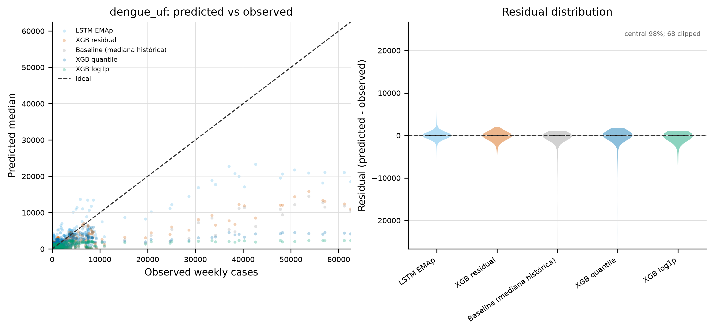

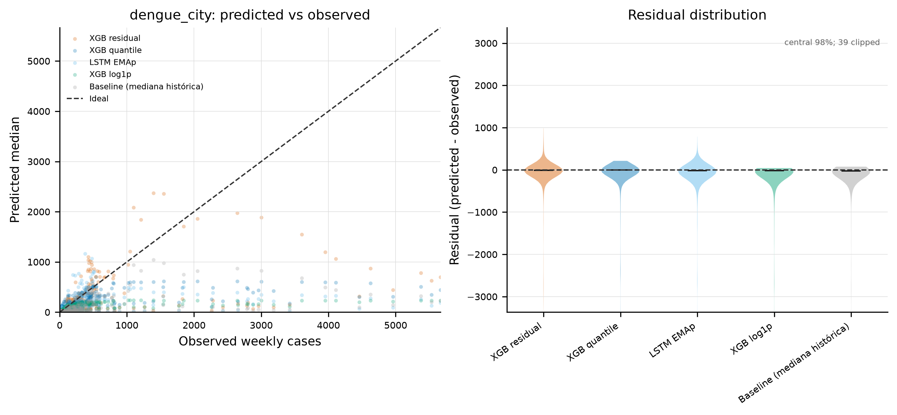

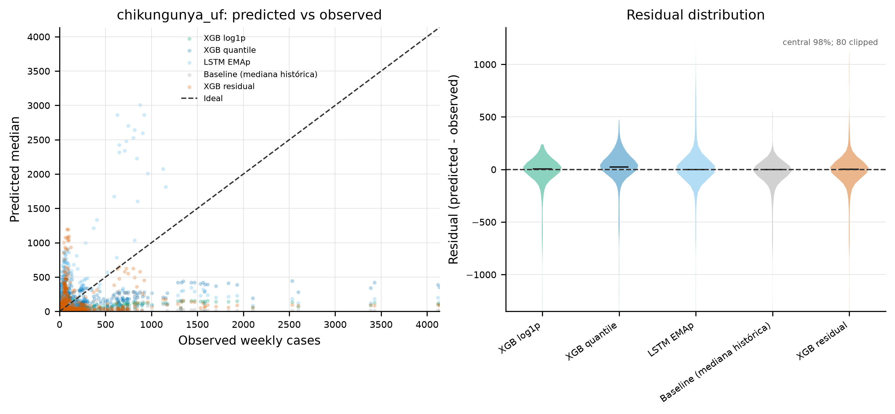

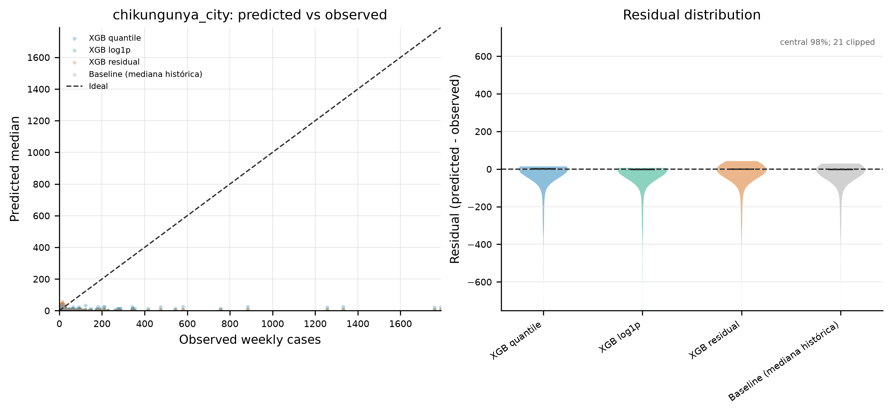

A tabela de resíduos por desafio é gerada automaticamente em `data/results/figures/model_comparison/{challenge}_validation_3_residuals.csv`. Ela resume média, mediana, dispersão e distribuição dos resíduos dos modelos mostrados nas figuras. A média do resíduo mede viés global, mas é sensível a poucos picos grandes. A mediana do resíduo mede calibração típica do centro da curva. O desvio padrão e os quantis dos resíduos indicam se o modelo erra de modo difuso ou se concentra falhas em surtos extremos. Nos gráficos, a distribuição de resíduos é exibida no intervalo central de 98% dos valores. Essa escolha não remove os extremos da tabela, ela apenas impede que poucas observações muito grandes comprimam visualmente a região onde quase todos os resíduos estão concentrados.

A interpretação estatística esperada é assimétrica. Em séries epidêmicas, a maioria das semanas tem baixa contagem, enquanto poucas semanas concentram muitos casos. Por isso, um modelo pode ter mediana residual próxima de zero e ainda apresentar média residual negativa se subestimar picos. Um ganho real deve aparecer simultaneamente em menor WIS, melhor alinhamento visual das curvas altas e resíduos menos assimétricos nas caudas.

## 9. Interpretação crítica e limitações

As variáveis de importância, correlação e VIF devem ser interpretadas como diagnóstico preditivo, não como evidência causal. O fato de uma variável MapBiomas, regional ou climática aparecer entre os principais preditores não implica que ela cause diretamente aumento de casos, ela pode representar contexto territorial, intensidade de vigilância, urbanização, sazonalidade compartilhada ou outras variáveis não observadas. Essa distinção é especialmente importante porque o modelo é desenhado para previsão probabilística, não para inferência causal.

O escopo municipal também precisa ser lido com cuidado. Os desafios municipais usam um conjunto específico de cidades definido em `src/config.py`, não todos os municípios brasileiros. Assim, conclusões sobre desempenho municipal dizem respeito a esse painel de validação e à distribuição de casos nele observada. Municípios com séries quase nulas podem contribuir para bom desempenho médio sem demonstrar capacidade de prever surtos relevantes, por isso as figuras de duas localidades boas e duas ruins são parte necessária da avaliação, não apenas ilustração.

Por fim, o LSTM EMAp entra no relatório como comparação externa, enquanto os três XGBoost são os modelos próprios desta pipeline. Portanto, diferenças entre LSTM e XGBoost misturam arquitetura, dados disponíveis, estratégia de treino e possível calibração externa. A comparação é útil como referência prática de desempenho, mas não isola causalmente o efeito de cada decisão de modelagem.

## 10. Ordem recomendada para reproduzir a pipeline e gerar os gráficos

```bash
uv sync
uv run python -m src.build_dataset
export MOSQLIMATE_API_KEY="sua-chave"
uv run python scripts/fetch_external_predictions.py
MODEL_DEVICE=cuda uv run python -m src.backtest
```

O comando `src.backtest` também gera automaticamente as figuras e tabelas usadas neste relatório em `data/results/figures/model_comparison/`, usando as previsões externas já baixadas quando disponíveis.

Para gerar as previsões finais e os arquivos de submissão:

```bash
MODEL_DEVICE=cuda uv run python -m src.forecast
uv run python -m src.submission
```
